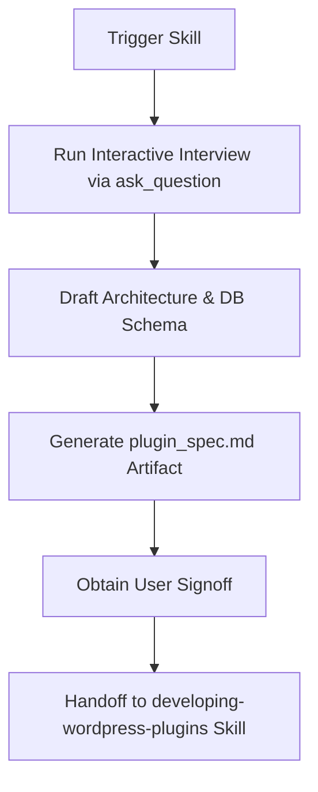

# Planning WordPress Plugins (Interactive Planner)

## When to use this skill
- Planning a new WordPress plugin prior to writing code.
- Gathering and clarifying user requirements for a WordPress plugin feature set.
- Designing WordPress database schemas, admin UI layouts, and class architectures.
- Ensuring a planned plugin strictly complies with WordPress.org Plugin Directory guidelines from day one.

---

## Interactive Interview Protocol

When this skill triggers, **DO NOT generate code immediately**. You MUST first interview the user to clarify key technical and product decisions.

Use the `ask_question` tool or structured interactive questions covering these 5 core phases (Refer to [references/questionnaire_guide.md](references/questionnaire_guide.md) for full context):

### Phase 1: Identity & Purpose
- What is the plugin title and intended slug? (Validate trademark rules: Must NOT start with "WordPress").
- What main problem does the plugin solve, and who is the target user (admin vs visitor)?

### Phase 2: UI & Touchpoints
- Where does the user interact with the plugin?
  - Options: Admin Settings page, Gutenberg Block, Shortcode, Elementor Widget, REST API, or Background Cron job.

### Phase 3: Data & Storage Strategy
- How will plugin data be stored?
  - Options: Options API (`wp_options`), Custom Post Types + Post Meta, or Custom SQL Tables (`$wpdb`).

### Phase 4: Third-Party & API Requirements
- Does the plugin connect to external third-party services or APIs?
  - Note: External services require explicit user consent and disclosure under WordPress.org Guideline #7.

### Phase 5: Licensing & WordPress.org Target
- Will this plugin be submitted to the official WordPress.org Plugin Directory?
  - (Enforces GPLv2+, strict prefixing, and no prohibited remote code).

---

## Step-by-Step Planning Workflow

### Step 1: Conduct the Questionnaire
- Ask targeted, concise questions using `ask_question` or formatted prompts.
- Allow the user to provide write-in answers or pick sensible defaults.

### Step 2: Establish Technical Specifications
- Determine unique slug (e.g., `my-plugin-slug`), PHP prefix (e.g., `mps_`), text domain, and constants.
- Design clean directory tree following standard WordPress plugin conventions.
- Define database table schemas or option key structures.

### Step 3: Generate Specification Artifact
- Use template from [resources/plugin_spec_template.md](resources/plugin_spec_template.md).
- Write generated specification to `plugin_spec.md` or present as an artifact for user review.

### Step 4: Signoff & Development Handoff
- Present the generated `plugin_spec.md` to the user.
- Once approved, proceed to invoke the `developing-wordpress-plugins` skill to generate the plugin boilerplate, header files, `readme.txt`, and core classes.

---

## Bundled References & Templates
- Full Questionnaire Reference Guide: [references/questionnaire_guide.md](references/questionnaire_guide.md)
- Plugin Specification Template: [resources/plugin_spec_template.md](resources/plugin_spec_template.md)
- Development Skill Integration: [developing-wordpress-plugins](../developing-wordpress-plugins/SKILL.md)
